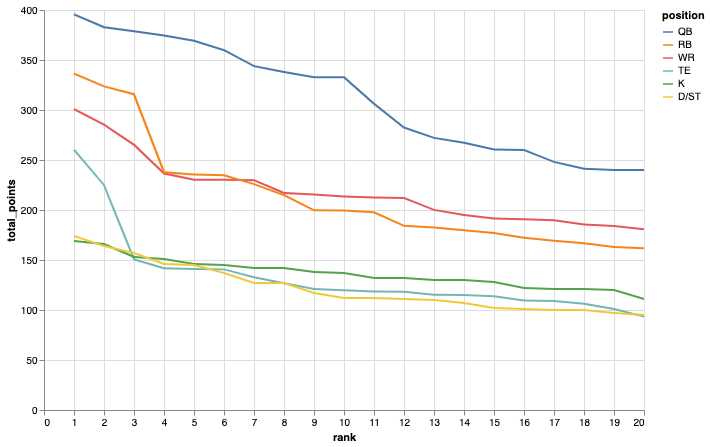
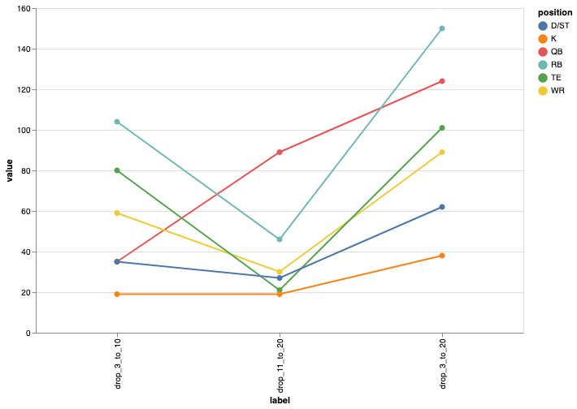

# section 1 - off-season

## League Analysis and Graphing (LAG)

You need to understand the effect fantasy scoring rules have on positions **for this year**.

* List the top 20 scorers in all positions used in your league from the previous season

## LAG / Scoring by Position

* The NFL produces roughly the same points per position every season
* The biggest variation is with the top three players that are much better than the rest
* There are also "natural tiers" aka (RB1, RB2, etc) visible in the data

_from lag.ipynb[^1]_

## 3-10-20

averages groupings of top ranked players by position:

* avg top 1, 2, and 3
* avg 4 through 10
* avg 11 through 20

## PPR

Added to FF around the year 2000 to minimize the advantages of teams with early draft picks. It worked.

RBs are still at the top (kind of) but WRs are all of a sudden much more attractive picks and that means more good players for late pick teams.

_There are fewer reasons to make the first two rounds become a "Name the Running Back" game._

It also means the teams with the top three running backs don't dominate.

Roughly this gvies you:

* 1-3 (great) - top tier players that will score big or huge points
* 4-10 (good) - the rest of the starts drafted in the league
* 11-20 (backup) - backup/second tier players

### RB

PPR increases the value of thid-down backs (not starters). In other words it makes RBs deeper in that the non-starters tend to score more, though they still won't score as much as a good WR.

### WR

1. TDs - scoring more TDs per catch over the rest of the league means **less fantasy points** because they have less receptions
2. yards per catch - same because they have fewer catches per yard relative to less "productive" receivers
3. possesion receivers - they **increase** in value since they have more PPR points

[^1]: [full notebook on nbviewer](https://nbviewer.jupyter.org/github/joeeoj/fantasy-football/blob/main/lag.ipynb)
